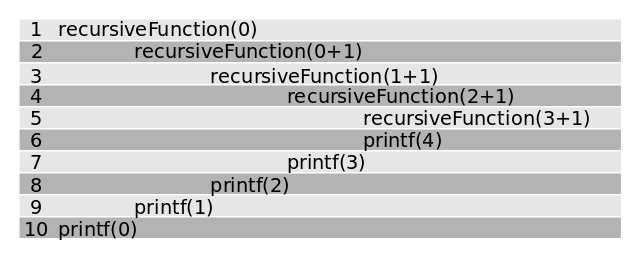

Recursion is a fundamental concept in computer science and mathematics, where a problem is solved by breaking it down into smaller instances of the same problem. In recursion, a function calls itself with simpler inputs, and the process continues until a base case is reached. This approach is not only elegant but also powerful for solving complex problems that have a natural recursive structure.

### What is Recursion?

A recursive solution consists of two main parts:

- **Base Case:** The simplest instance of the problem, which can be solved directly.
- **Recursive Case:** The problem is divided into one or more simpler subproblems, and the solution is built using the results of these subproblems.

Recursion is widely used in algorithms, such as searching, sorting, combinatorics, and dynamic programming. It helps express solutions in a clear and concise way, especially for problems that involve repeated or self-similar structures.



_Figure: A trace of recursive function calls and their corresponding outputs. This table shows how recursive calls are stacked and unwound, illustrating the order in which function calls are made and completed in recursion._

When a recursive function is called, each invocation is placed on the call stack. The image above demonstrates how each call waits for the next, and how the results are printed as the stack unwinds. Understanding this flow is crucial for debugging and designing recursive algorithms.

---

### Why Study Recursion?

- Recursion simplifies the solution of problems that are naturally hierarchical or self-referential.
- It is the foundation of many advanced algorithms, including divide-and-conquer and dynamic programming.
- Understanding recursion improves your ability to think algorithmically and solve challenging problems.

---

### Problems Explored in This Experiment

In this experiment, you will solve two classic problems using recursion:

### 1. Balancing Weights on a Scale

**Problem Statement:**
You are given a set of $N$ different weights (1, 2, 4, ..., $2^{N-1}$ units) and a stone of known weight $W < 2^N$ placed on the left side of a scale. Determine how many possible ways there are to place the weights on either side of the scale to achieve equilibrium (balance).

**Input Specification:**

- The input line contains two integers: $N$ (number of weights) and $W$ (weight on the left side).

**Output Specification:**

- Output a single integer: the number of ways to balance the weight $W$ by placing weights on any side.

**Sample Input and Output:**

```
Input: 2 4
Output: 3
Input: 5 10
Output: 14
```

**Recursive Approach:**
At each step, decide for each weight whether to place it on the left pan, right pan, or not use it. The recursive function explores all combinations, and the base case is when all weights have been considered.

---

### 2. Subset Sum with Weighing Pan

**Problem Statement:**
Given a weighing pan, $n$ weights, and a destination weight $D$, print "YES" if it is possible to measure $D$ using the given weights (by placing them on either side of the pan), otherwise print "NO".

**Input Specification:**

- Input begins with the number of weights $n$, followed by $n$ values (the weights), and finally the destination weight $D$.

**Output Specification:**

- Output "YES" if it is possible to measure $D$, otherwise "NO".

**Sample Input and Output:**

```
Input: 3 1 3 4 2
Output: YES
Input: 2 1 3 5
Output: NO
```

**Recursive Approach:**
For each weight, you have three choices: place it on the left pan, place it on the right pan, or not use it. The recursion explores all combinations, and the base case is when all weights are used. If the difference between the two pans equals zero (or the target), the answer is "YES".

---

_This experiment encourages you to implement recursive algorithms for balancing weights and subset sum problems, deepening your understanding of recursion and its applications in problem solving._
